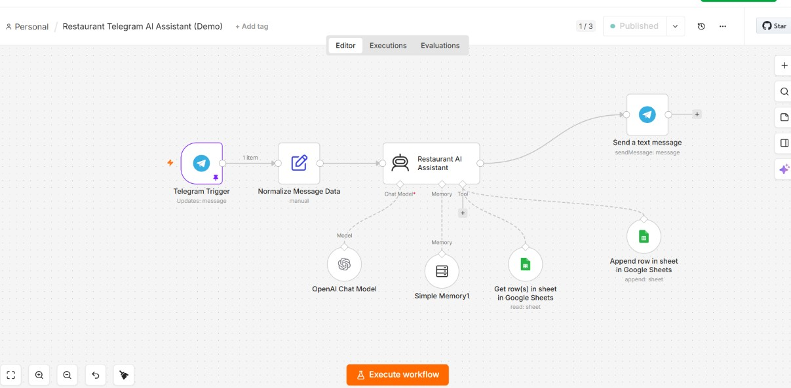
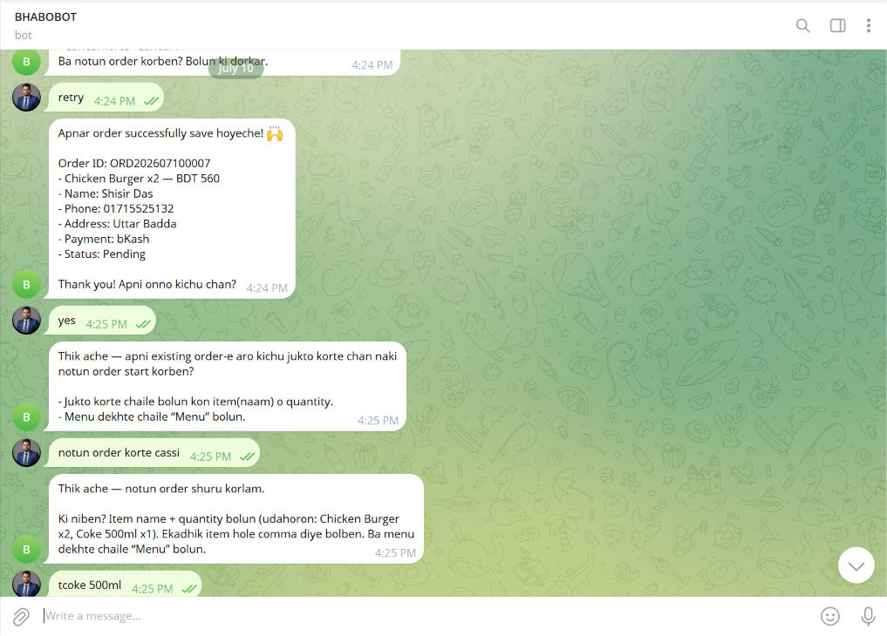
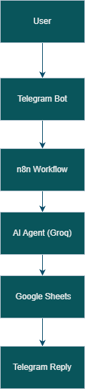

# 🍽️ Telegram AI Restaurant Assistant

An AI-powered Restaurant Recommendation Assistant built using **n8n**, **Telegram Bot**, **Groq AI**, and **Google Sheets**.

---

## 🚀 Project Overview

This project helps users discover restaurants through Telegram. The AI understands natural language questions, searches restaurant information from Google Sheets, and provides intelligent recommendations instantly.

---

## ✨ Features

- 🤖 AI-powered restaurant recommendation
- 💬 Telegram chatbot
- 📍 Search by location
- 🍕 Search by cuisine
- ⭐ Restaurant rating support
- 📊 Google Sheets database
- 🔄 n8n workflow automation
- ⚡ Real-time responses

---

## 🛠️ Tech Stack

| Tool | Purpose |
|------|----------|
| n8n | Workflow Automation |
| Telegram Bot | User Interface |
| Groq AI | AI Response |
| Google Sheets | Restaurant Database |
| Webhook | Receive Messages |

---

## 🔄 Workflow

```text
User
   │
Telegram Bot
   │
Telegram Trigger
   │
n8n Workflow
   │
AI Agent
   │
Google Sheets
   │
Telegram Response
```

---

## 📂 Project Structure

```text
telegram-ai-restaurant-assistant/
│
├── workflows/
├── screenshots/
├── sample-data/
├── prompts/
└── README.md
```

---

## 📸 Screenshots


### n8n Workflow



### Telegram Chat



### Google Sheets Database


### Architecture Diagram



---

## 📈 Future Improvements

- Multi-language support
- Table reservation
- Google Maps integration
- Restaurant reviews
- Menu recommendation
- Voice support

---

## 👨‍💻 Author

**Bhabotos Kumar**

Network Engineer | AI Automation Enthusiast | n8n Developer

LinkedIn:
https://www.linkedin.com/in/bhabotos-kumar-bd/
